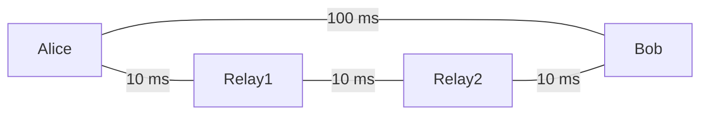

# study-simqn

[SimQN](https://github.com/QNLab-USTC/SimQN)을 작은 실험부터 익히는 Python 예제 모음임.
**이벤트 → 큐비트 → 채널 → 라우팅 → 얽힘 분배** 순서로 진행하면 됨.
양자 하드웨어나 외부 서비스 없이 로컬에서 실행 가능함.

## 빠르게 실행하기

Python **3.11 또는 3.12** 권장함. 아래 명령은 저장소 루트에서 실행함.

```bash
git clone https://github.com/ExistenceOne/study-simqn.git
cd study-simqn
python3 -m venv .venv
source .venv/bin/activate
python -m pip install -r requirements.txt
python examples/01_events.py
```

Windows에서는 가상환경 활성화 명령만 다름.

```powershell
.venv\Scripts\Activate.ps1
```

`uv`가 있다면 다음 방식도 가능함.

```bash
uv venv --python 3.11
uv pip install --python .venv/bin/python -r requirements.txt
source .venv/bin/activate
```

설치 패키지 이름은 `qns`임. 테스트한 버전은 **qns 0.2.3**이며,
NumPy와 Pandas도 `requirements.txt`에 버전 고정했음.

## 예제 목록

| 순서 | 예제 | 배우는 것 | 실행 명령 |
| --- | --- | --- | --- |
| 01 | [이벤트](examples/01_events.py) | 가상 시간, 이벤트 예약·취소 | `python examples/01_events.py` |
| 02 | [큐비트](examples/02_qubits.py) | X/H/CNOT, 측정 확률, Bell 쌍 | `python examples/02_qubits.py` |
| 03 | [채널 손실](examples/03_channel_loss.py) | 두 노드 연결, 수신 앱, 지연·손실 | `python examples/03_channel_loss.py` |
| 04 | [라우팅](examples/04_routing.py) | 최소 홉과 최소 지연 경로 | `python examples/04_routing.py` |
| 05 | [얽힘 분배](examples/05_entanglement_distribution.py) | 토폴로지, 메모리, 내장 프로토콜 | `python examples/05_entanglement_distribution.py` |

결과는 JSON으로 출력됨. 기본 설정의 실제 실행 결과는
[docs/sample-results.json](docs/sample-results.json)에 저장했음.
시간 단위는 초, `seed` 기본값은 42임.
CLI 옵션이 있는 02·03·05는 `--help`로 옵션 확인 가능함.

## 01. 이벤트 예약과 취소

**실험:** 0.3초, 0.2초, 0.1초 순서로 이벤트를 등록함.
0.15초 이벤트는 실행 전에 취소함.

```bash
python examples/01_events.py
```

**관찰:** 출력 순서는 `first → second → third`, 실행 시각은 `0.1 → 0.2 → 0.3`임.
`canceled`는 출력에 없음. 등록 순서가 아니라 이벤트 시각 순서대로 처리됨.

**코드 흐름:** `Simulator` 생성 → `func_to_event`로 함수 예약 → `add_event` → `run`.
`accuracy=1_000_000`은 1초를 백만 슬롯으로 나눠서 1 μs 해상도로 처리한다는 뜻임.
가상 시간 1초가 실제 대기 시간 1초를 뜻하지는 않음.

**추가 실험:** 등록 시각을 바꾸거나 `canceled.cancel()`을 주석 처리해보면 됨.
같은 시각 이벤트의 처리 순서는 이 예제에서 보장하지 않음.

## 02. 큐비트 측정과 Bell 쌍

**실험:** 각 반복마다 새 큐비트를 준비해서 Z 기저로 측정함.

- 기본 0 상태: 항상 0 나옴.
- X 게이트 적용: 1 상태가 되므로 항상 1 나옴.
- H 게이트 적용: 0과 1이 각각 약 절반 나옴.
- 두 큐비트에 H와 CNOT 적용: Bell 쌍을 만들고 둘 다 측정함.

```bash
python examples/02_qubits.py
python examples/02_qubits.py --shots 10000 --seed 7
```

**기본 결과:** 0 상태는 0이 1000회, 1 상태는 1이 1000회 나왔음.
H 적용 상태는 0/1이 500/500회 나왔음.
Bell 쌍은 `00`이 507회, `11`이 493회, `01`과 `10`은 0회였음.

**해석:** Bell 쌍의 개별 측정 결과는 무작위지만 둘의 결과는 일치함.
이 예제는 이상적인 게이트·측정 모델임. 측정 상관관계가 즉시 정보를 전송한다는 뜻은 아님.

**추가 실험:** `--shots`를 늘려 빈도가 어떻게 변하는지 확인함.
표본 횟수가 유한하므로 항상 정확히 50:50이 되지는 않음.
같은 seed와 같은 의존성 버전으로 실행하면 같은 결과를 얻을 수 있음.
같은 큐비트를 반복 측정하는 것과 매번 새로 준비하는 것은 다른 실험임.

## 03. 양자 채널의 지연과 손실

**실험:** `Alice — QuantumChannel — Bob` 구성임.
Alice가 큐비트를 1 ms마다 보내고 Bob의 `Receiver` 앱이 수신 이벤트를 기록함.
손실을 따로 난수로 계산하는 게 아니라 SimQN 채널의 송수신을 실제로 실행함.

```bash
python examples/03_channel_loss.py
python examples/03_channel_loss.py --count 10000 --drop-rates 0 0.2 0.5 1
python examples/03_channel_loss.py --delay 0.1 --drop-rates 0
```

**기본 결과:** 1000개 송신 기준임.

| 설정 손실률 | 수신 | 손실 | 관측 손실률 |
| --- | ---: | ---: | ---: |
| 0 | 1000 | 0 | 0.000 |
| 0.3 | 681 | 319 | 0.319 |
| 0.7 | 288 | 712 | 0.712 |
| 1 | 0 | 1000 | 1.000 |

**해석:** 30% 손실 확률을 넣어도 한 번의 실험에서 정확히 300개가 손실되지는 않음.
손실은 큐비트별 독립 확률로 모델링됨. 각 손실률 실험은 같은 seed로 다시 시작함.
`observed_loss_rate`는 `lost / sent`임.

`delay=0.01`이면 손실 없는 경우 첫 큐비트는 0.01초,
마지막 큐비트는 1.009초에 도착함.
모든 수신이 끝난 뒤 종료하므로 아직 이동 중인 큐비트를 손실로 잘못 세지 않음.
수신이 0개면 첫·마지막 도착 시각은 `null`임.

**가정:** `bandwidth=0`은 무제한 대역폭임. 버퍼 손실과 큐 대기는 제외했음.
채널 손실과 양자 상태 노이즈는 별개임. 이 예제에서는 상태 노이즈를 넣지 않음.
지연은 1 μs 해상도로 양자화됨.

**추가 실험:** 지연만 바꾸면 도착 시각이 변하고, 손실률을 바꾸면 수신 수가 변함.
이 둘을 따로 바꿔서 확인하면 됨.

## 04. 최소 홉 경로와 최소 지연 경로

**실험:** 직접 연결은 100 ms, 중계 링크는 각각 10 ms인 네트워크임.



```bash
python examples/04_routing.py
```

**관찰:** 기본 Dijkstra 비용은 링크당 1임.
최소 홉 경로는 `Alice → Bob`, 비용은 1홉임.
비용을 링크 지연으로 바꾸면 `Alice → Relay1 → Relay2 → Bob`이 선택됨.
지연 합은 0.03초로 직접 연결의 0.1초보다 작음.

**코드 흐름:** 노드·채널 추가 → `build_route()` → `query_route()`.
이후 `metric_func`를 바꾸고 라우팅 테이블을 다시 만듦.
`query_route()`의 반환값은 비용, 다음 홉, 전체 경로를 포함함.

**가정:** 이 예제는 경로 계산만 수행함. 큐비트 전달이나 중계 프로토콜을 실행하지 않음.
`cost_seconds`는 설정된 링크 지연의 합이며 실제 분배 완료 시간과 같지 않음.

**추가 실험:** 직접 링크의 지연을 0.02로 바꾸면 최소 지연 경로도 직접 연결이 됨.
링크를 수정한 뒤 `build_route()`로 경로를 다시 계산해야 함.

## 05. 중계 노드를 통한 얽힘 분배

**실험:** 양자 링크는 `n1 — n2 — n3 — n4` 선형 구성임.
각 노드에 메모리와 내장 `EntanglementDistributionApp`을 설치하고
`n1 → n4` 분배 요청을 하나 등록함.
중간 노드는 프로토콜에 따라 얽힘 교환을 수행함.

```bash
python examples/05_entanglement_distribution.py
python examples/05_entanglement_distribution.py --nodes 2
python examples/05_entanglement_distribution.py --nodes 8
python examples/05_entanglement_distribution.py --fidelity 0.95
python examples/05_entanglement_distribution.py --delay 0.03
python examples/05_entanglement_distribution.py --send-rate 10 --memory 50
```

**기본 결과:** 5초 동안 분배를 26번 시작하고, 목적지에서 25쌍 완료됨.
초당 완료 쌍은 5.0, 완료 쌍의 평균 충실도는 약 0.970398임.
처음 링크를 생성할 때의 충실도는 0.99임.

| 옵션 | 기본값 | 뜻 |
| --- | ---: | --- |
| `--nodes` | 4 | 송신자·목적지를 포함한 노드 수, 최소 2 |
| `--duration` | 5 | 가상 실험 시간, 초 |
| `--send-rate` | 5 | 초당 분배 시작 횟수 |
| `--delay` | 0.01 | 양자·고전 채널 각각의 지연, 초 |
| `--memory` | 20 | 각 노드의 메모리 용량, 최소 2 |
| `--fidelity` | 0.99 | 초기 Werner 상태의 충실도, 0부터 1 |
| `--seed` | 42 | 난수 초기값 |

**집계 기준:**

- `attempted`: 송신자가 시작한 횟수. 0초와 종료 시각에도 시작할 수 있어서 26회가 됨.
- `completed`: 종료 시각까지 목적지에서 완료된 쌍 수임.
- `acknowledged_at_source`: 완료 통지가 송신자에 도착한 수임. 완료 수와 다를 수 있음.
- `pairs_per_second`: 목적지 완료 수를 전체 실험 시간으로 나눈 값임.
- `mean_fidelity`: 완료된 Werner 쌍의 평균 충실도임. 완료 0건이면 `null`임.

`attempted - completed`를 전부 실패로 해석하면 안 됨.
종료 시각에 진행 중인 요청도 포함됨.

**가정:** 내장 프로토콜의 성공 통지는 목적지에서 송신자로 직접 전달됨.
그래서 고전 채널은 `ClassicTopology.All`로 모든 노드 쌍을 연결함.
양자 링크만 선형이며, 고전 제어 메시지는 선형 경로를 따라 라우팅하는 모델이 아님.
채널 대역폭은 무제한, 손실률과 메모리 디코히런스는 0임.
충실도 감소는 이 설정에서 주로 Werner 모델의 얽힘 교환으로 발생함.
충실도 숫자만으로 일반적인 상태의 모든 성질을 표현할 수 있는 것은 아님.
초기 충실도를 아주 낮게 설정하면 `completed`를 실제 얽힌 쌍의 수로 해석하면 안 됨.
이는 내장 프로토콜의 완료 수이며, 얽힘 존재 여부를 별도로 검사하는 지표는 아님.

**추가 실험:** 노드 수만 바꾸면서 평균 충실도를 비교함.
이후 초기 충실도, 지연, 분배 속도를 하나씩 바꾸면 원인 구분이 쉬움.
속도를 크게 올리면 메모리 경쟁과 실험 종료 시 미완료 요청의 영향을 함께 받음.
이 예제는 내장 프로토콜 학습용이며 특정 장비의 실측 성능 모델이 아님.

## 테스트

```bash
python -m unittest discover -s tests -v
```

실제 CLI를 실행해서 이벤트 순서·취소, 큐비트 측정·상관관계,
채널 손실·도착 시각, 경로 선택, 얽힘 완료·0건 처리를 검사함.
잘못된 입력과 seed 재현성도 검증함.
GitHub Actions에서도 Python 3.11·3.12로 실행함.

## 참고·라이선스

- [SimQN 원본 저장소](https://github.com/QNLab-USTC/SimQN)
- [SimQN 공식 문서](https://qnlab-ustc.github.io/SimQN/)
- [공식 Quick start](https://qnlab-ustc.github.io/SimQN/tutorials.quickstart.html)

SimQN 개발자는 QNLab, University of Science and Technology of China임.
이 저장소는 별도의 학습 예제 프로젝트이며 SimQN 공식 프로젝트가 아님.
SimQN의 라이선스는 GPL-3.0임. 이 예제 저장소도 [GPL-3.0](LICENSE)으로 배포함.
