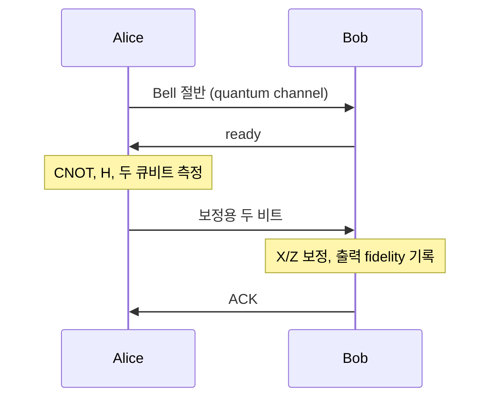

# 17–20: 분산 양자 연산과 양자 센서 네트워크

SimQN 0.2.3에서 실제 큐비트 상태와 채널 이벤트를 함께 사용하는 예제임.
기존 `requirements.txt`만으로 실행 가능함. 모든 명령은 저장소 루트 기준임.

```bash
python examples/17_network_teleportation.py
python examples/18_remote_cnot.py
python examples/19_independent_sensor_network.py
python examples/20_entangled_sensor_network.py
```

결과는 JSON으로 출력됨. 옵션은 각 파일의 `--help`로 확인함.
기본 실행 결과는 [distributed-sample-results.json](distributed-sample-results.json)에 있음.

## 17. 네트워크 텔레포테이션

Alice에 입력 큐비트와 Bell 쌍의 절반을 저장하고 나머지 절반을 Bob에게 전송함.
Bob이 수신 후 `ready` 메시지를 보내면 Alice가 CNOT/H/Bell 측정을 수행함.
측정한 두 비트를 고전 채널로 보내고 Bob은 수신 후 X/Z 보정함.
마지막으로 Bob이 Alice에 ACK를 보냄.



입력은 0, 1, +, -, +i, -i 상태를 차례로 사용함.
`--shots`는 전체 시도 수임. 예를 들어 120이면 각 입력을 20번 사용함.
각 시도마다 새 Simulator와 Bell 쌍을 만들며 재시도는 하지 않음.

```bash
python examples/17_network_teleportation.py --shots 600 --fidelity 0.9
python examples/17_network_teleportation.py --drop-rate 0.3
python examples/17_network_teleportation.py --t2 0.02 --classical-delay 0.02
```

내장 `BaseEntanglement.teleportion()`은 측정과 보정까지 동기적으로 처리하며
실제 고전 메시지를 전송하지 않음. 이 예제는 `TeleportApp`을 양쪽 노드에 설치하고
그 단계를 메시지 수신 이벤트로 나눠 통신 대기와 메모리 잡음을 반영함.

기본 양자·고전 지연은 각각 10 ms임. Bell 측정은 20 ms, Bob 보정은 30 ms,
Alice ACK 수신은 40 ms임. `completed`는 Bob의 출력 준비 완료 기준임.
`mean_completion_seconds`와 `mean_ack_seconds`를 구분해서 확인하면 됨.

## 18. 원격 CNOT

Alice의 control과 Bob의 target에 원격 CNOT을 수행함.
공유 Bell 쌍을 a/b라고 부르면 실제 로컬 연산 순서는 다음과 같음.

1. Bob이 b를 수신하고 Alice에게 `ready` 전송함.
2. Alice가 CNOT(control, a), a의 Z 측정을 수행하고 결과 한 비트를 전송함.
3. Bob이 결과에 따라 X(b), CNOT(b, target), H(b), b의 Z 측정을 수행함.
4. Bob이 측정 결과 한 비트를 보내면 Alice가 Z(control) 보정함.

앱은 자신이 가진 큐비트에만 게이트를 적용함. 외부 observer가 완료 후 공동 상태를 읽어서
이상적인 로컬 CNOT 결과와 비교함. 중앙 제어 앱이나 라우팅 프로토콜은 사용하지 않음.
SimQN의 공동 밀도행렬은 상태 계산을 위한 시뮬레이터 내부 표현임.

control/target 각각 0, 1, +, +i를 사용해서 총 16개 입력 조합을 순환함.
중첩 상태의 얽힘과 복소 위상이 보존되는지까지 확인할 수 있음.

```bash
python examples/18_remote_cnot.py --shots 160
python examples/18_remote_cnot.py --fidelity 0.9 --t2 0.03
python examples/18_remote_cnot.py --drop-rate 1
```

기본 완료 시간은 40 ms임. Bob의 target은 마지막 phase 비트가 Alice에게 도착하는
시각까지 메모리에 보관하고 같은 시각에 꺼냄. 두 노드의 출력이 모두 준비된 후 fidelity를 읽음.

표준 원격 CNOT은 공유 Bell 쌍 하나와 각 방향으로 고전 비트 하나를 사용함.
이 예제의 `ready` 패킷은 추가 준비 통지임.
[프로토콜 근거: Eisert et al.](https://arxiv.org/abs/quant-ph/0005101)

### 원격 연산 옵션·출력

| 옵션 | 기본값 | 의미 |
| --- | --- | --- |
| `--shots` | 120 | 총 준비 시도 수 |
| `--quantum-delay` | 0.01 | Bell 절반 전송 지연, 초 |
| `--classical-delay` | 0.01 | 고전 메시지 편도 지연, 초 |
| `--drop-rate` | 0 | Bell 절반의 독립 전송 손실 확률 |
| `--fidelity` | 1 | 초기 Werner 쌍의 Bell 상태 overlap |
| `--t2` | 0 | 메모리 T2, 초. 0이면 잡음 비활성화 |
| `--seed` | 42 | 난수 seed |

`bell_pairs_created`와 `quantum_transmissions`는 실패를 포함한 시도 수임.
`classical_packets_sent`는 ready·ACK 등 제어 패킷을 포함함.
`classical_payload_bits`는 연산 보정 비트만 집계하고 JSON 헤더·제어 패킷의 실제 바이트 수는 제외함.
`by_input`은 입력별 완료 수와 평균 fidelity를 제공함.
`measurement_branches`는 완료한 시도의 측정 비트 분포임.
`first_trial_trace`는 첫 시도의 실제 이벤트 시각임.

양자 링크가 전손실이면 완료 수는 0, fidelity와 완료 시간은 `null`임.
종료 시간은 정상 프로토콜의 마지막 이벤트보다 10 μs 뒤로 잡아 이동 중인 큐비트를 실패로 세지 않음.
고전 링크는 손실이 없고 대역폭 제한은 사용하지 않음.

## 19. 독립 Ramsey 센서

기본 센서는 3개임. Sensor0이 상태 준비 노드·센서·고전 결과 수집 노드를 겸함.
Sensor0에서 각 센서용 독립 + 상태를 준비하고 원격 센서에 큐비트를 분배함.
각 노드는 자신의 메모리에 저장하고 공유 시계로 정한 시각에 독립적으로 측정함.
원격 측정 결과는 실제 고전 채널로 Sensor0에 전달됨.

각 센서는 공통 위상 \(\phi\)와 알려진 기준 위상 \(\pi/2\)를 `RZ`로 적용한 뒤 X 측정함.
측정 비트 0/1을 +1/-1로 읽으면 이상적인 기대값은 다음과 같음.

$$
\mathbb{E}[x_i] = -\sin(\phi).
$$

```bash
python examples/19_independent_sensor_network.py --shots 1000 --repeats 20
python examples/19_independent_sensor_network.py --phase 0.2 --t2 0.02
```

`phase`는 interrogation 동안 누적된 위상(rad)임. 자기장·주파수 같은 실제 물리량을
추정하려면 감도 상수와 interrogation 시간으로 위상을 계산하는 모델을 추가하면 됨.
현재 예제는 위상 센싱이며 특정 센서 장비를 모델링하지 않음.

## 20. GHZ 센서와 독립 센서 비교

Sensor0에서 H와 로컬 CNOT으로 GHZ 상태를 만들고 각 절반을 센서에 전송함.
상태 준비 이후에는 각 센서가 자신의 큐비트에만 RZ와 X 측정을 수행함.
고전 결과 수집 노드는 모든 센서의 측정 비트를 받아 parity를 계산함.

\(N\)개 센서의 기준 위상은 각각 \(\pi/(2N)\)임. 그러면 이상적인 parity 기대값은 다음과 같음.

$$
\mathbb{E}\!\left[\prod_{i=1}^{N} x_i\right] = -\sin(N\phi).
$$

```bash
python examples/20_entangled_sensor_network.py --shots 1000 --repeats 20
python examples/20_entangled_sensor_network.py --drop-rate 0.2
python examples/20_entangled_sensor_network.py --t2 0.02
python examples/20_entangled_sensor_network.py --nodes 4 --phase 0.1
```

20번은 독립 방식과 GHZ 방식을 모두 실행함. 두 방식에 같은 센서 수·준비 시도 수·채널 지연·손실·T2를 적용함.
각 방식의 총 센서 사용 횟수는 `nodes * shots * repeats`이고,
양자 전송 시도 수는 `(nodes - 1) * shots * repeats`임.
실패한 시도도 비용에 포함하며 성공할 때까지 반복하지 않음.
독립 방식은 일부 센서 결과만 도착해도 그 측정을 사용함.
GHZ 방식은 모든 센서 결과가 도착한 round만 parity 추정에 사용함.

준비 게이트가 이상적이고 즉시 수행되는 모델이므로 GHZ의 실제 준비 비용은 이 비교에 포함되지 않음.
총 예약 시간과 상태 준비·전송 시도 수를 함께 출력하지만, 실제 장비의 비용이 같다는 뜻은 아님.
[분산 센싱 배경: Zhang and Zhuang](https://arxiv.org/abs/2010.14744)

### 센서 옵션·통계 해석

| 옵션 | 기본값 | 의미 |
| --- | --- | --- |
| `--nodes` | 3 | 센서 수. 공동 상태 계산 비용 때문에 2–6으로 제한 |
| `--shots` | 200 | 반복 하나당 준비 시도 수 |
| `--repeats` | 8 | 위상 추정 실험의 독립 반복 수 |
| `--phase` | 0.1 | 모든 센서에서 동일한 누적 위상, rad |
| `--interrogation` | 0.005 | 분배 후 측정까지의 시간, 초 |
| `--quantum-delay` | 0.01 | 원격 센서로의 전송 지연, 초 |
| `--classical-delay` | 0.01 | 측정 결과 전송 지연, 초 |
| `--drop-rate` | 0 | 원격 큐비트의 전송 손실 확률 |
| `--t2` | 0 | 메모리 T2, 초. 0이면 잡음 비활성화 |
| `--seed` | 42 | 반복 r의 seed는 `(seed + r) % 2**32` |

두 방식 모두 알려진 국소 범위 \(\lvert\phi\rvert < \pi/(2N)\)를 사용함.
기준 위상으로 감도가 있는 측정점을 잡고 arcsin으로 추정함. 전 위상 범위 탐색은 지원하지 않음.
표본 잡음 때문에 역변환 입력이 범위를 벗어나면 [-1, 1]로 clip함.
이는 적은 표본·큰 잡음에서 추정 편향을 만들 수 있음.

`expected_signal`은 모델의 기대 신호이고 `observed_signals`는 실제 큐비트 측정으로 얻은 반복별 신호임.
알려진 T2와 지연으로 계산한 visibility를 사용해서 위상을 추정함.
독립 방식은 수신한 센서별 visibility로 보정하고 GHZ 방식은 전체 visibility로 보정함.
visibility가 1e-12 이하이면 해당 역변환 데이터를 사용하지 않음.
보정 가능한 데이터가 없으면 추정값·RMSE는 `null`임.

`estimates`는 반복별 위상 추정값, `rmse`는 참 위상에 대한 추정 오차의 제곱평균제곱근임.
`bias`는 평균 오차, `estimate_std`는 반복별 추정값의 표본 표준편차임.
`estimate_mean_standard_error`는 반복 평균의 표준오차임. 유효 반복이 2개 미만이면 표준편차·표준오차는 `null`임.
일부 반복에 데이터가 없으면 유효 반복만 집계하므로 `valid_estimate_repeats`와 성공률을 함께 확인함.

`expected_fisher_information_per_attempt`는 동일한 시도 예산에서 모델이 제공하는 국소 Fisher information임.
이상적인 경우 GHZ의 정보량은 독립 방식의 N배임. 이는 전체 센서 사용 횟수가 같은 경우의 비교임.
손실과 탈위상으로 실제 이득은 감소하고 없어질 수도 있음.
유한한 반복에서 출력한 RMSE가 반드시 이 정보량 비율을 따르거나 GHZ가 항상 좋다는 뜻은 아님.
현재 보정 평균 추정기는 잡음이 센서마다 다를 때 최적 추정기를 보장하지 않음.

## 공통 물리 가정과 코드 위치

T2 저장 잡음은 다음 Z 오류 혼합으로 구현함.

$$
p(t)=\frac{1-e^{-t/T_2}}{2},\qquad
\rho(t)=(1-p(t))\rho+p(t)Z\rho Z.
$$

`QuantumMemory.read()`가 실제 저장 시간을 계산해서 noise hook을 호출함.
기존 작업 중인 `_noise.py`와는 별도로 [_distributed.py](../examples/_distributed.py)에 구현했음.
채널의 손실과 메모리의 상태 잡음은 서로 다른 효과임.
비행 중 상태 잡음, 게이트·측정 오류, classical loss, 동기화 오차는 이 예제에서 제외함.
모든 시간은 초 단위이며 SimQN의 1 μs 슬롯 해상도로 양자화됨.
센서 보정은 입력 지연을 각각 슬롯에 맞춰 내린 실제 시간으로 계산함.
`effective_delays_seconds`와 `storage_times_seconds`에서 적용된 시간을 확인할 수 있음.

센서 기본 설정에서 source의 저장 시간은 15 ms, 원격 센서의 저장 시간은 각각 5 ms임.
고전 결과가 도착하는 25 ms 이후에는 센서 큐비트가 이미 측정되었으므로 추가 메모리 잡음은 없음.

17·18의 프로토콜은 각 예제의 Application 클래스에 있음.
19·20의 동일한 채널·측정·수집 흐름은 [_sensor_network.py](../examples/_sensor_network.py)에 공유함.
`run()`에서 independent/GHZ 모드를 선택하고, `experiment()`의 `prepare()`에서 실제 상태 준비 회로를 확인할 수 있음.

```bash
python -m unittest discover -s tests -p 'test_distributed_computing.py' -v
python -m unittest discover -s tests -p 'test_sensor_network.py' -v
python -m unittest discover -s tests -v
```

테스트는 실제 CLI·채널·큐비트 계산을 실행함. 원격 상태 보존, 통신 대기,
전손실, 잡음에 따른 신호 감소, 자원 집계, seed 재현성, 입력 검증을 확인함.
