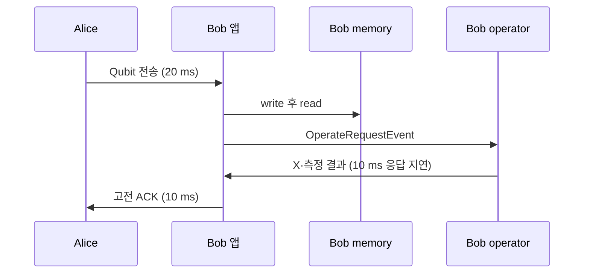

# SimQN 모듈 예제 06–16

저장소 루트에서 기존 가상환경을 활성화하고 실행함.
기본 실행은 `requirements.txt`만 필요함. Python 3.11·3.12, qns 0.2.3 기준임.
모든 예제는 JSON으로 결과를 출력하고 `--help`를 지원함.
[기본 실행 결과](module-sample-results.json)도 저장했음.

## 06. Qubit backend

```bash
python examples/06_qubit_backend.py
python examples/06_qubit_backend.py --shots 10000 --flip-probability 0.5 --seed 7
```

`Qubit`은 상태벡터 입력도 밀도행렬로 표현함. 0 상태, H를 적용한 + 상태,
밀도행렬 `I/2`인 완전 혼합 상태와 측정 직전 비트 반전을 비교함.
혼합 상태와 + 상태는 Z 측정 빈도는 비슷하지만 밀도행렬의 비대각 성분이 다름.
0 상태에 비트 반전 확률 1을 주면 모든 결과가 1임.

`QubitFactory`에 오류 함수를 주입하므로 설치된 라이브러리는 수정하지 않음.
qns 0.2.3의 `Qubit.measure()`는 오류 함수에 `decoherence_rate` 키워드를 전달하지만
내장 `BitFlipError`는 `p`를 받음. [_noise.py](../examples/_noise.py)는
이 인자를 연결함. 이 예제의 measure rate는 시간당 감쇠율이 아니라 오류 확률임.

## 07. Entanglement backend

```bash
python examples/07_entanglement_backend.py
python examples/07_entanglement_backend.py --fidelity 0.95 --storage-time 5 --decoherence-rate 0.2
python examples/07_entanglement_backend.py --bell-swap-probability 0.3
python examples/07_entanglement_backend.py --mixed-weights 0.9 0.05 0.03 0.02
```

Werner 쌍의 초기 충실도 0.9를 기본값으로 사용함.
저장 오류는 `w(t)=w(0) exp(-rate*t)`, 교환은 `w_out=w_left*w_right`임.
여기서 `w=(4F-1)/3`, `F=(3w+1)/4`임. 충실도 0.9의 두 쌍을 교환하면 약 0.813333임.
저장과 교환은 서로 다른 새 객체로 수행하므로 원인을 따로 비교할 수 있음.

정제는 내장 `distillation()`을 반복 호출함. 성공하면 새 쌍, 실패하면 `None`을 반환함.
성공 수와 성공한 출력의 평균 충실도를 함께 보고함. 실패를 충실도 0으로 평균에 넣지 않음.
교환·정제는 입력 두 쌍을 소비하므로 매번 새 객체를 생성함.
낮은 초기 충실도에서 정제가 항상 좋아지는 것은 아니며, 프로토콜 성공 수가
얽힘 존재나 실제 장비 성능을 보장하는 지표도 아님.

동일 실행에서 `bell`과 `mixed` 결과도 출력함. 기존 최상위 필드는 Werner 결과임.
`--fidelity`는 Werner에만, `--bell-swap-probability`는 Bell 교환에만,
`--mixed-weights A B C D`는 Mixed에만 적용됨.
모델별 난수 seed는 각각 `seed`, `seed+1`, `seed+2`를 32bit 범위로 감싼 값임.

| 모델 | 초기 상태·저장 | 교환·정제 |
| --- | --- | --- |
| `BellStateEntanglement` | 이상적 Bell, 충실도 1; 기본 저장 오류 없음 | 이 예제의 p_swap=0.5로 확률적 교환; 새 이상적 입력의 정제는 충실도 1 |
| `WernerStateEntanglement` | 충실도 한 값, 균일한 세 오류 성분; 지수 감쇠 | Werner 교환식과 확률적 정제 |
| `MixedStateEntanglement` | 네 Bell 가중치; 이 예제는 0.9/0.05/0.03/0.02; 각 값이 0.25로 감쇠 | 네 가중치의 교환과 확률적 정제 |

Mixed의 순서는 `Phi+`, `Psi+`, `Psi-`, `Phi-`이며 각 가중치는 0–1, 합은 1이어야 함.
라이브러리의 Bell 생성자 기본 p_swap은 1이며, 예제에서 성공·실패를 관찰하도록 0.5로 설정했음.
생성자의 자동 정규화로 잘못된 확률 입력이 숨겨지지 않게 CLI에서 합을 검사함.
Bell 교환은 실패해도 객체를 반환하므로 `is_decoherenced`를 확인해 성공 수를 셈.
성공한 Bell 출력의 충실도는 1이고, 성공이 없으면 평균은 `null`임.
교환·정제에 소비된 입력을 재사용하지 않고 모든 조건에서 새 쌍을 만듦.

**qns 0.2.3 Mixed 교환식 주의:** 설치 소스의 출력 d 식에 `c1*d2`가 들어가지만,
Bell 대각 상태 합성식의 해당 항은 `c1*b2`임.
비대칭 가중치에서는 정규화된 출력도 기준값과 달라짐.
기본 입력의 기준 교환 가중치는 0.8138/0.0912/0.056/0.039임.
예제는 라이브러리를 수정하지 않고 `swapped_weights`, `reference_swapped_weights`,
`swap_max_abs_error`, `swap_matches_bell_convolution`을 함께 출력함.
마지막 값이 `false`이면 내장 교환 결과를 정확한 물리 결과로 해석하면 안 됨.
Werner형 대칭 가중치에서는 이 문제의 차이가 나타나지 않을 수 있음.
Mixed는 Bell 대각 상태 모델이며 임의의 두 큐비트 밀도행렬 전체를 나타내지는 않음.

## 08. Entanglement → qubit backend

```bash
python examples/08_entanglement_to_qubits.py
python examples/08_entanglement_to_qubits.py --fidelities 0.25 0.75 0.9 1 --shots 10000
```

`WernerStateEntanglement.to_qubits()`로 얽힘 객체를 두 `Qubit`으로 구체화함.
두 큐비트는 동일한 공동 `QState`와 4×4 밀도행렬을 공유함.
변환 전에 지정한 충실도가 변환 뒤 Bell 상태와의 overlap에 보존되는지 출력함.

```python
pair = WernerStateEntanglement(fidelity=0.9)
alice, bob = pair.to_qubits()
rho = alice.state.rho.copy()  # 측정 전에 기록함
X(alice)
bits = (alice.measure(), bob.measure())
```

원본 Werner의 상태는 `rho = w * BellProjector + (1-w) * I/4`로 전개됨.
Z 측정의 같은 bit 확률은 `(1+w)/2`이며 F 자체와 다름.
F=1에서는 00/11만 나오고, 변환 후 Alice에 X를 적용하면 01/10만 나옴.
F=0.25이면 완전 혼합 상태라 같은 bit 비율은 약 절반임.
각 측정 반복과 게이트 적용 조건마다 새로운 얽힘 객체를 준비함.

변환은 원본에 `is_decoherenced=True`를 설정함. 여기서는 **소비 여부 표시**임.
같은 원본에서 두 번째로 `to_qubits()`를 호출해 같은 쌍을 복제하려 하면 안 됨.
Werner 구현이 stdout에 출력하는 행렬은 해당 호출 동안만 캡처해서 JSON이 깨지지 않게 함.

`MixedStateEntanglement`에도 별도 `to_qubits()`가 있고,
`BellStateEntanglement`는 `BaseEntanglement.to_qubits()`를 상속함.
이 예제는 Werner 구현을 사용함. 전체 simulator의 backend를 일괄 변경하는 기능은 아니며,
원래 얽힘 모델에 없는 임의의 물리 상태 정보를 복원하는 변환도 아님.

## 09. Topology generator

```bash
python examples/09_topology_generators.py
python examples/09_topology_generators.py --nodes 16 --seed 7
```

같은 노드 수로 `LineTopology`, `GridTopology`, `WaxmanTopology`를 생성함.
linear가 SimQN에서 `LineTopology`라는 이름으로 제공됨.
노드 수, 링크 수, 노드별 차수, 링크 endpoint·길이, 그래프 연결성을 출력함.
기본 9노드에서 linear는 8링크, 3×3 grid는 12링크임.
Grid 때문에 노드 수는 4 이상의 완전제곱수여야 함.

Waxman은 1000 m 영역, alpha=0.8, beta=0.5를 사용함.
링크 확률은 `alpha * exp(-distance/(beta*max_distance))`이며 가까운 노드가 연결되기 쉬움.
qns 0.2.3은 연결된 그래프가 나올 때까지 최대 100회 재생성함.
연결성 검사가 bandwidth=0을 연결되지 않은 것으로 처리하므로 이 생성 예제는
bandwidth=1을 사용함. 전송 실험은 실행하지 않음.
Line/Grid 기본 길이와 Waxman의 공간 길이를 동일한 물리 배치로 해석하면 안 됨.

## 10. 노드에 entity와 앱 설치

```bash
python examples/10_node_entities.py
```

Alice·Bob 각각에 `QuantumMemory`, `QuantumOperator`를 등록함.
한 `QuantumChannel`과 한 `ClassicChannel`을 두 노드 모두에 등록함.
`add_memory`, `add_operator`, `add_qchannel`, `add_cchannel`, `add_apps` 호출 후
`node.install(simulator)`가 등록된 entity와 앱을 설치함.
채널은 두 노드가 공유하는 링크 객체이고, 메모리와 operator는 노드별 객체임.



Bob 앱은 수신한 0 상태 큐비트를 memory에 저장하고 꺼내 operator에 넘김.
memory의 동기 `write/read`는 지연을 추가하지 않고, `read`는 큐비트를 제거함.
operator의 비동기 요청은 반환 응답에 설정 지연을 적용함.
연산 자체는 요청 처리 시점에 일어나고, 10 ms 뒤 결과 이벤트가 도착함.
측정값은 1, 양자 수신은 0.02초, 연산 응답은 0.03초, ACK 수신은 0.04초임.
메모리에서 꺼낸 뒤 사용량은 0임. 채널 손실·저장 잡음은 제외했음.

## 11. ClassicPacketForwardApp 설치

```bash
python examples/11_classical_apps.py
python examples/11_classical_apps.py --count 10
```

고전 채널은 `n1 — n2 — n3`로만 연결함. 각 채널 지연은 10 ms임.
고전 채널 목록으로 경로표를 만들고 각 노드에 내장 `ClassicPacketForwardApp`을 설치함.
송신 앱 대신 이벤트로 n1→n2의 첫 전송을 예약함.
패킷의 최종 목적지는 n3이므로 n2의 앱이 자동 forwarding함.
기본 패킷 세 개는 0.02·0.03·0.04초에 n3에 도착함.

앱 처리 순서는 **관찰 앱 → forwarding 앱 → 목적지 앱**임.
관찰 앱은 `False`를 반환해서 다음 앱이 처리하게 함.
중간 노드에서는 forwarding 앱이 전송 후 `True`를 반환해 후속 처리를 중단함.
목적지에서는 `False`를 반환하므로 목적지 앱이 메시지를 받음.
trace에 중간·목적지 수신을 기록함. 라우팅 알고리즘 비교 예제는 포함하지 않음.

## 12. BB84SendApp·BB84RecvApp 설치

```bash
python examples/12_bb84_apps.py
python examples/12_bb84_apps.py --duration 10 --seed 7
```

Alice에 내장 `BB84SendApp`, Bob에 내장 `BB84RecvApp`을 설치함.
두 앱에 동일한 양자·고전 채널 객체를 넘김. quantum delay와 classical delay는
각각 1 ms, 손실·잡음 0, 송신 1000 Hz, 기본 실행은 5초임.
현재 qns의 기본 후처리 설정을 그대로 사용함.

양쪽 `key_pool`의 공통 블록 수, 내용 일치 여부와 일치한 bit 수를 출력함.
키의 실제 bit 값은 출력하지 않음. 종료 순간 진행 중인 후처리 때문에
양쪽 블록 수가 다를 수 있음. 짧게 실행하면 완성 블록이 없을 수 있으며
이때 `common_blocks_equal`은 `null`임.
`remaining_raw_bits`는 후처리 전 남은 버퍼 수이며 총 생성 bit 수가 아님.

이 예제는 현재 내장 후처리 앱 학습용임. 인증된 고전 채널 등 실제 QKD의 보안 조건을
구현한 것은 아니므로 출력 bit를 실서비스 비밀키로 쓰면 안 됨.
Fig. 3 재실행에서 사용한 역사적 correct-sifted count와는 다른 지표임.

## 13. Request management

```bash
python examples/13_request_management.py
python examples/13_request_management.py --nodes 12 --requests 5 --seed 7
```

`add_request()`로 수동 요청 하나를 등록한 뒤,
`random_requests(..., allow_overlay=False)`로 endpoint를 중복하지 않는 요청을 생성함.
**random_requests는 기존 네트워크와 노드의 요청 목록을 교체함.**
따라서 수동 요청이 사라지는 동작과 양 끝 노드에 등록되는 요청 수를 함께 보여줌.
중복 금지에서는 `requests * 2 <= nodes` 필요함.

마지막에는 `allow_overlay=True`로 노드 수만큼 요청을 생성해서
endpoint 재사용이 실제 발생함을 보여줌. 한 요청의 src와 dest는 여전히 서로 다름.
이 예제는 요청 등록만 수행함. 요청 객체 생성만으로 큐비트 전달이나
얽힘 분배가 자동 실행되는 것은 아니며 프로토콜 앱 설치가 별도로 필요함.

## 14. Data collector

```bash
python examples/14_data_collector.py
python examples/14_data_collector.py --output results/monitor-demo.csv
```

0.1·0.4·0.7초에 완료 count를 증가시키는 이벤트를 예약함.
`Monitor.add_attribution()`으로 count와 누적 count/time을 등록하고,
`at_start()`와 `at_period(0.25)`로 관측함.
0·0.25·0.5·0.75·1초의 count는 0·1·2·3·3임.
`completed_per_second`는 이전 관측 이후의 순간율이 아니라 시작부터의 누적 평균임.
0초에는 나눗셈을 하지 않고 0으로 기록함.

qns에서 반환 메서드 이름은 `get_date()`임. 반환된 Pandas DataFrame을
JSON records와 선택적인 CSV로 저장함. 기존 CSV는 CLI에서 덮어쓰지 않음.
여기서는 주기 관측이 종료 시각도 포함하므로 `at_finish()`를 추가하지 않음.
관측 시각과 완료 이벤트를 다르게 두어 같은 시각 이벤트 순서에 의존하지 않음.

## 15. Cython accelerated core

```bash
python examples/15_cython_acceleration.py --events 100000 --repeats 5
```

이벤트 등록과 처리 모두를 포함한 wall time을 측정함.
매 반복 새 simulator를 생성하고, 실제 호출 수와 index 합을 검증함.
`qns.simulator.ts`, `pool`, `simulator`의 실제 로딩 경로와 확장 모듈 여부를 출력함.
기본 pip 설치가 Python 모듈이면 `all_core_modules_compiled=false`가 정상임.

[Cython 빌드 안내](cython-build.md)에 별도 환경에서 코어를 빌드하고
동일 명령으로 비교하는 절차가 있음. `--require-compiled`는 확장 모듈이 실제로
로드되지 않으면 CLI 오류를 반환함. 임의의 속도 향상을 가정하거나 고정 비율로 보고하지 않음.

## 16. Parallel simulator

```bash
python examples/16_parallel_simulations.py
python examples/16_parallel_simulations.py --shots 10000 --repeats 5 --cores 2 --seed 7
```

`MPSimulations`를 상속하고 `run(setting)`에 **한 번의 독립 실험**을 작성함.
각 실험의 simulator에서 큐비트 생성·측정 이벤트를 실행함.
오류 확률 0·0.2·1의 조건 조합을 기본 3회씩 실행하고 평균·표본 표준편차를 집계함.
조건·반복 ID에서 seed를 정하고 worker마다 초기화하므로 PID나 실행 순서에 의존하지 않음.
동일 설정을 직렬로도 실행해 모든 원시 결과가 일치하는지 검증함.

`repeats >= 2`를 요구함. summary의 std는 표본 표준편차이며 SEM이 아님.
`experiment_seed`도 라이브러리의 일반 숫자 집계에 포함되지만 성능 지표로 해석하지 않음.
프로세스 생성 비용 때문에 작은 실험은 병렬 쪽이 더 느릴 수 있음.
이 기능은 **여러 실험의 병렬 실행**이며 하나의 네트워크 이벤트 큐를 분산 실행하는 기능은 아님.
Windows/macOS spawn을 위해 main guard와 `freeze_support()`를 사용함.
내장 MPSimulations가 worker 오류를 출력하고 결과를 누락할 수 있어
예상 결과 행 수를 확인하고 누락 시 실행을 실패 처리함.

## 검증과 추가 파일

```bash
python -m pip install -r requirements-evaluation.txt
python -m unittest discover -s tests -v
```

[test_module_examples.py](../tests/test_module_examples.py)는 변환 전후 밀도행렬·측정,
공동 상태, 잡음 극단값, 링크 수·seed, entity 이벤트 시각, 다중 홉 패킷,
BB84 키 블록, 요청 교체, 실제 CSV, 이벤트 checksum, 직렬·병렬 동등성,
잘못된 입력과 Cython 출력 폴더 보호를 검사함.
기존 예제·evaluation 테스트도 함께 실행함.

- [SimQN 물리 모델 공식 문서](https://qnlab-ustc.github.io/SimQN/tutorials.models.html)
- [원본 Cython 빌드 스크립트](https://github.com/QNLab-USTC/SimQN/blob/main/setup-cython.py)

공식 웹 문서는 0.1.3으로 표시되어 현재 설치 API와 차이가 있을 수 있음.
예제의 실제 API는 설치된 qns 0.2.3 소스로 확인했음.
