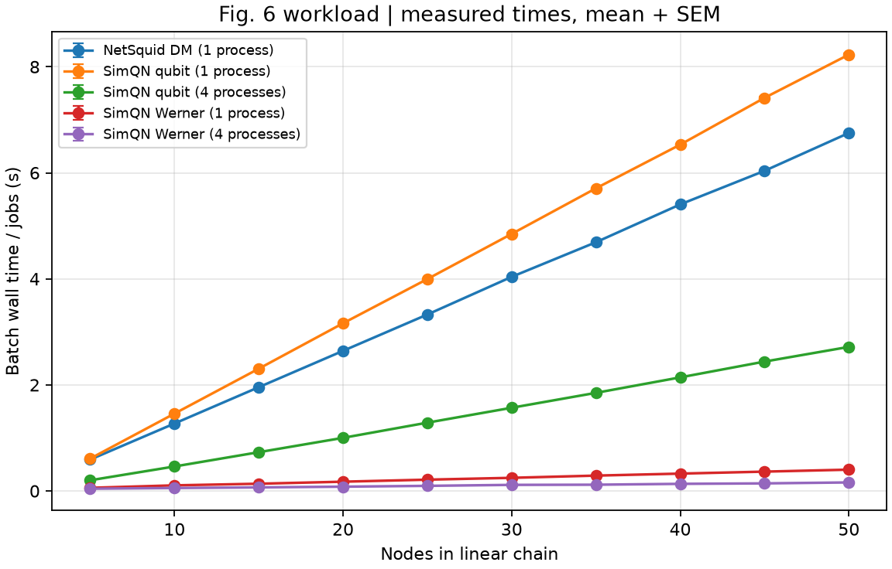
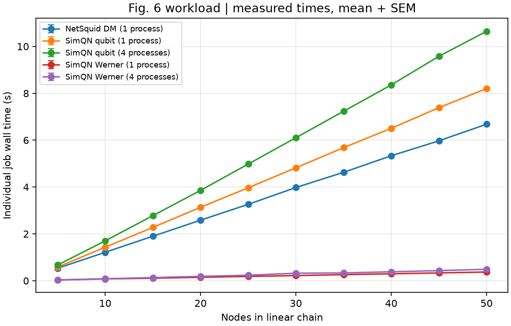

# 실행 결과

Fig. 3·5는 2026-10-04, Fig. 6은 2026-10-09에 실행한 결과임. 각 폴더의 `metadata.json`에서 실제 설정,
패키지 버전, 실행 시간과 `status=complete`를 확인할 수 있음.
지표와 재현 한계는 [실험 설명](../README.md)에 정리했음.

| 폴더 | 실행 범위 | 반복 수 |
| --- | --- | --- |
| [historical-fig3](historical-fig3/) | Fig. 3(a) 24조건, 3(b) 10조건; 당시 공개 손실·잡음 모델 | 조건별 10회 |
| [paper-stated-fig3](paper-stated-fig3/) | 같은 Fig. 3 조건; 0.2 dB/km와 가정한 비트 반전 함수 | 조건별 10회 |
| [historical-fig5](historical-fig5/) | 400노드·1200링크, 10/20/30/40세션, 송신 10–100 Hz | 조건별 3회 |
| [smoke](smoke/) | 작은 규모의 Fig. 3·5 동작 확인 | 조건별 2회 |
| [fig6-full](fig6-full/) | Fig. 6: 5–50노드, SimQN 네 곡선 + NetSquid DM 1-worker | 조건별 8 jobs × 3 batches |
| [fig6-smoke](fig6-smoke/) | Fig. 6: 2/5노드·0.01초 동작 확인 | 조건별 4 jobs × 2 batches |

그래프의 오류 막대는 SEM임. CSV에는 개별 실행과 요약 통계가 모두 있음.
Fig. 5는 세션별 완료 수·충실도도 저장했음.
논문에 없는 조건은 추가 가정이므로 원본 그림 수치와 완전히 일치하는 결과로 해석하면 안 됨.

## Fig. 3: 당시 공개 예제 기준

## Fig. 3: 본문 손실식 기준

## Fig. 5

## Fig. 6

동일 Python 3.11·NumPy 1.26.4 환경에서 SimQN 큐비트/Werner의 1/4-worker와
NetSquid 1.1.8 DM의 1-worker를 Apple M4에서 측정함. 총 150 batches·1200 measured jobs이며,
각 process의 unmeasured warmup은 총 330회임. worker는 독립 실험을 실행하는 process임.
주 그래프는 startup·IPC·teardown을 포함한 batch wall time을 jobs로 나눈 값이며,
warmup barrier 구간만 제외함. 개별 실험 latency도 별도 그림으로 저장했음.

CSV에서 시간뿐 아니라 완료 수·충실도·이벤트 수를 확인할 수 있음.
모든 measured job의 완료 수·평균 충실도를 독립적인 해석식과 대조한 결과는
metadata의 `quality_validation`에 기록함.
원문의 미공개 설정·시간 집계 범위와 실제 장비가 달라 논문 배율의 정확한 재현은 아님.
같은 장비에서도 백그라운드 부하와 프로세스 생성 비용에 따라 결과가 달라질 수 있음.

실측 batch speedup 평균 범위는 qubit 3.03–3.16배, Werner 1.40–2.55배임.
원시 값은 [speedups](fig6-full/fig6_speedups.csv), 노드별 평균·SEM은
[speedup summary](fig6-full/fig6_speedup_summary.csv)에 있음.
