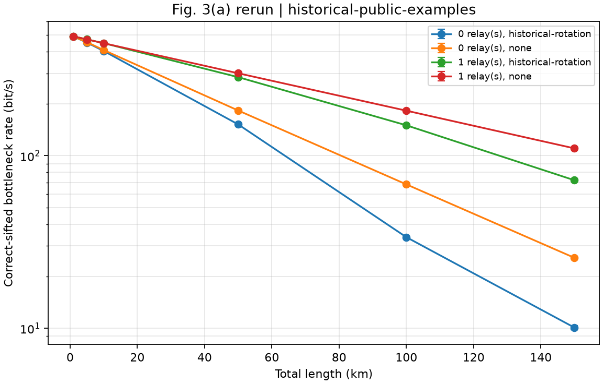
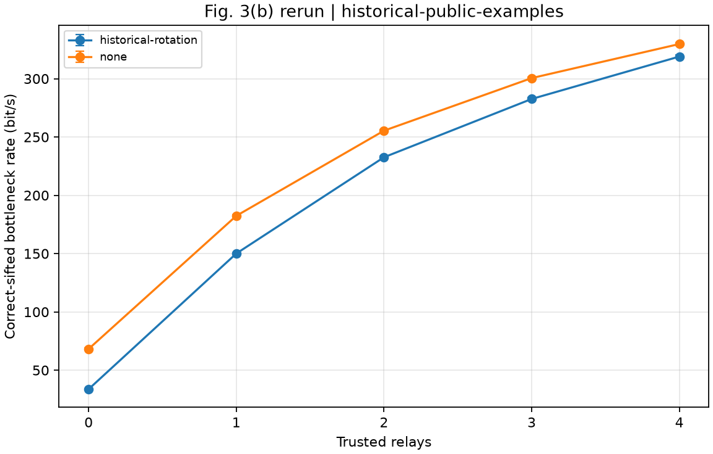
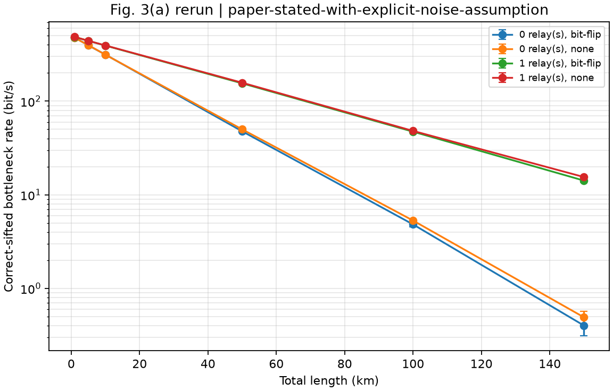
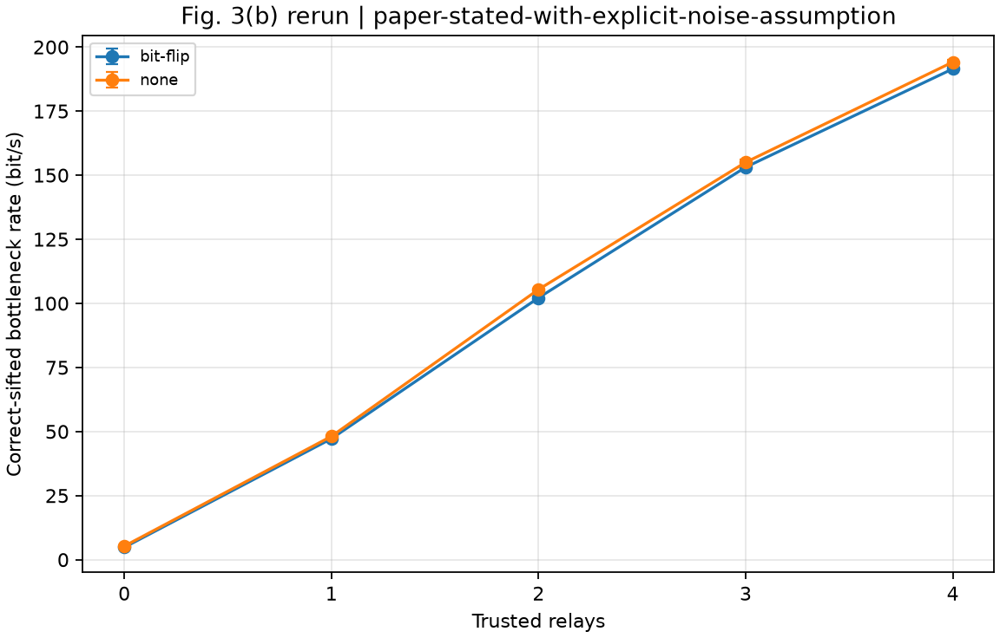
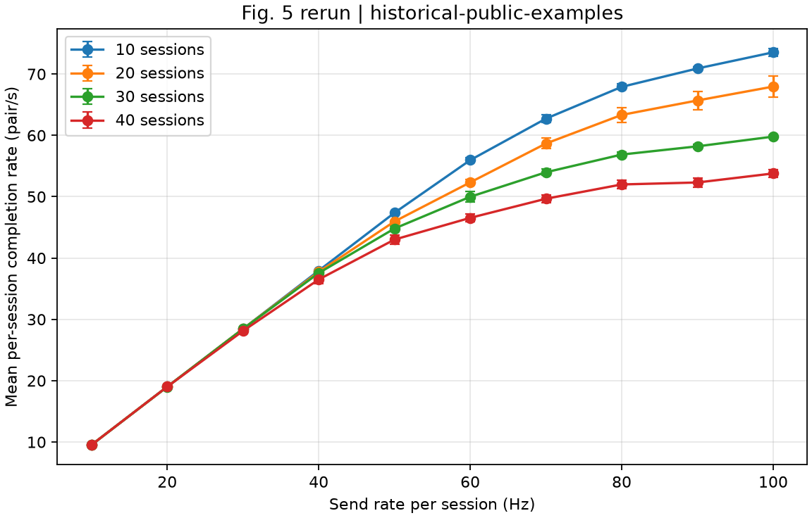

# 실행 결과

2026-10-04에 실행한 결과임. 각 폴더의 `metadata.json`에서 실제 설정,
패키지 버전, 실행 시간과 `status=complete`를 확인할 수 있음.
지표와 재현 한계는 [실험 설명](../README.md)에 정리했음.

| 폴더 | 실행 범위 | 반복 수 |
| --- | --- | --- |
| [historical-fig3](historical-fig3/) | Fig. 3(a) 24조건, 3(b) 10조건; 당시 공개 손실·잡음 모델 | 조건별 10회 |
| [paper-stated-fig3](paper-stated-fig3/) | 같은 Fig. 3 조건; 0.2 dB/km와 가정한 비트 반전 함수 | 조건별 10회 |
| [historical-fig5](historical-fig5/) | 400노드·1200링크, 10/20/30/40세션, 송신 10–100 Hz | 조건별 3회 |
| [smoke](smoke/) | 작은 규모의 Fig. 3·5 동작 확인 | 조건별 2회 |

그래프의 오류 막대는 SEM임. CSV에는 개별 실행과 요약 통계가 모두 있음.
Fig. 5는 세션별 완료 수·충실도도 저장했음.
논문에 없는 조건은 추가 가정이므로 원본 그림 수치와 완전히 일치하는 결과로 해석하면 안 됨.

## Fig. 3: 당시 공개 예제 기준

## Fig. 3: 본문 손실식 기준

## Fig. 5

